# practicas_maui 
Prácticas y proyectos de la materia de Taller de Desarrollo de Móvil para Plataforma Windows, relacionadas con NET Multi-platform App UI (.NET MAUI), un marco multiplataforma para crear aplicaciones móviles y de escritorio nativas con C# y XAML. 

## `TDMPW_1P_EX` 
### **Calculadora de Unidades de Energía**
Creación de una aplicación multiplataforma sobre una calculadora de unidades de energía siguiendo el diseño de estructura proporcionado por el profesor con las siguientes especificaciones:
* **VISTA**: La aplicación tiene una pantalla de bienvenida; una página donde se puede calcular la potencia en vatios (watts), solicitando una cantidad de amperios y voltios (P = A*V ) y finalmente otra página se debe calcular la potencia en watts necesaria para un proceso industrial, solicitando los joules necesarios y el tiempo en segundos (P = J/s).
* **FUNCIONALIDAD**: Permite navegar entre páginas utilizando `TabbedPage`, usar un `Grid` y `StackLayout` para cada una de las páginas. Además de realizar correctamente las operaciones especificadas.

#### Página de Bienvenida: 
 

#### Página de Watts: 
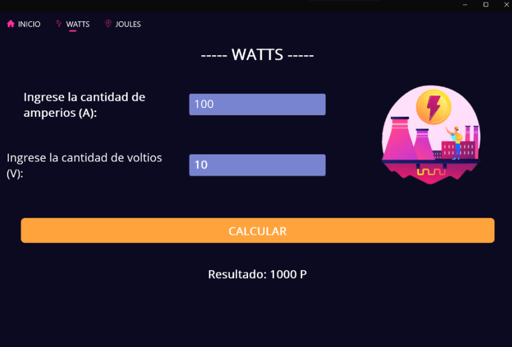 

#### Página de Joules: 

## `TDMPW_2P_PR01` 
### **Libro Favorito**: 
Creación de una aplicación multiplataforma acerca de tu libro favorito siguiendo el diseño de estructura proporcionado por el profesor con las siguientes especificaciones:
* **VISTA**: Cada página debe contener por lo menos una imagen, la primer vista será una página de inicio con un breve resumen de la historia, y por lo menos dos páginas más, cada una para un personaje con una breve descripción de la biografía del personaje.
* **FUNCIONALIDAD**: Permite navegar entre páginas utilizando `TabbedPage`, asi como el uso de `Frame` e `ImageButton`, el usuario puede elegir si le gusta o no el personaje y deberá mostrar el cambio en el label.

#### Página de Bienvenida: 
 

#### Página Personaje 1: 
 

#### Página Personaje 2: 

## `TDMPW_2P_PR02` 
### **Calculadora Conversión de Moneda**: 
Creación de una aplicación multiplataforma que permita la conversión de moneda siguiendo el diseño de estructura proporcionado por el profesor con las siguientes especificaciones:
* **VISTA**: Cada página debe contener por lo menos una imagen. Los cambios de moneda sera de pesos a Dolar, Euro y Libra.
* **FUNCIONALIDAD**: Permite navegar entre páginas utilizando `FlyoutPage`, el usuario podrá ingresar la cantidad por medio de un `Entry` y convertirlo a través de un `Button`, el resultado se mostrará en un `Label`.

#### Página de Bienvenida: 
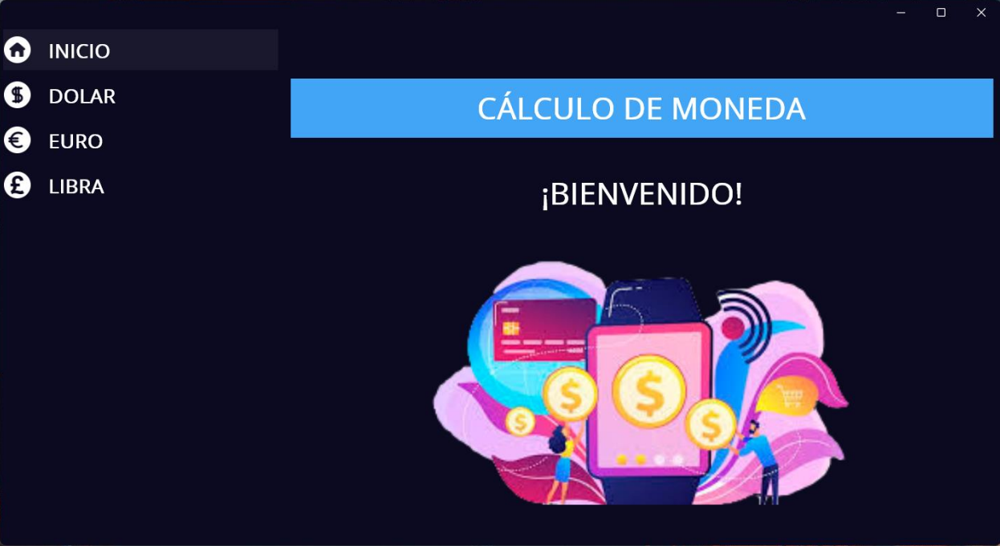 

#### Página Dolar: 
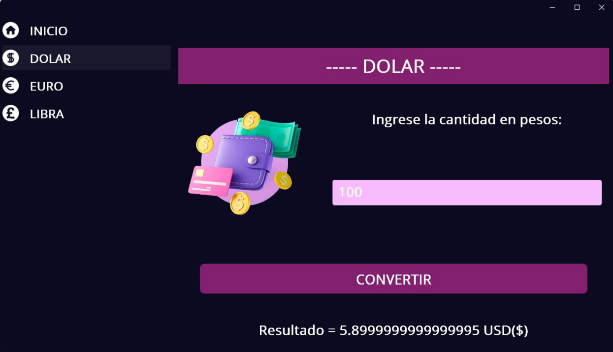 

#### Página Euro: 
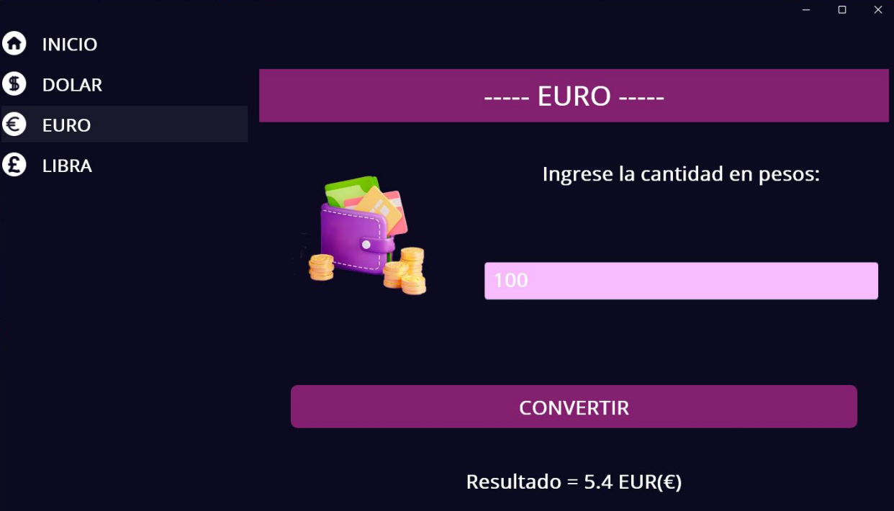

#### Página Libra: 
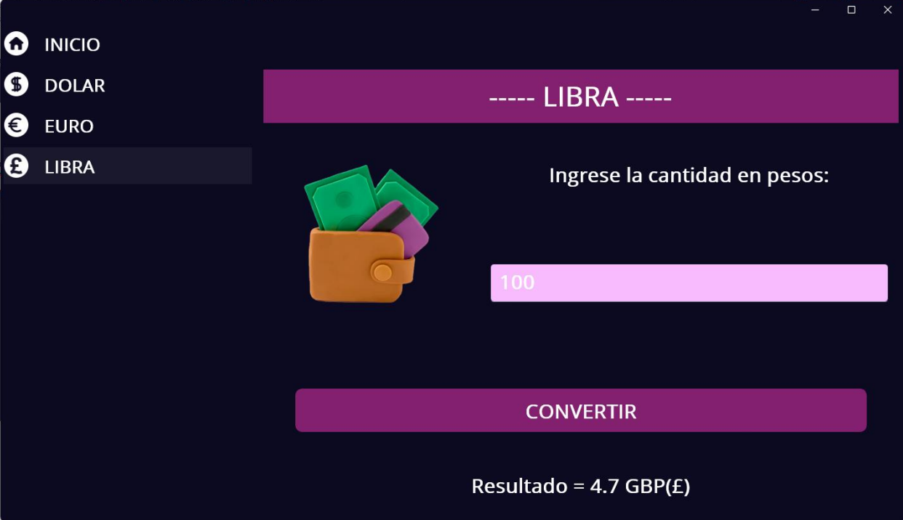

## `TDMPW_2P_PR03` 
### **Hobbies**: 
Creación de una aplicación multiplataforma para mostrar hobbies siguiendo el diseño de estructura proporcionado por el profesor con las siguientes especificaciones:
* **VISTA**: Usar fuentes personalizadas en todas las páginas, la primer página sera de inicio, en la segunda el usuario ingresara su nombre y se mostrarán 3 hobbies que el usuario puede puntar, y el la ultima el usuario podrá agregar y puntuar un hobbie.
* **FUNCIONALIDAD**: Permite navegar entre páginas utilizando `TabbedPage`, el usuario puntuara los hobbies por medio de `Slider` y `Stepper`, en la tercer página cuando el switch está habilitado se puede mover el slider si está deshabilitado, solo se puede mover por medio del stepper.

#### Página de Bienvenida: 
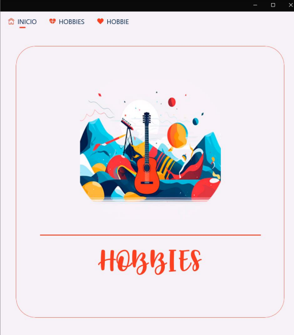 

#### Página Hobbies: 
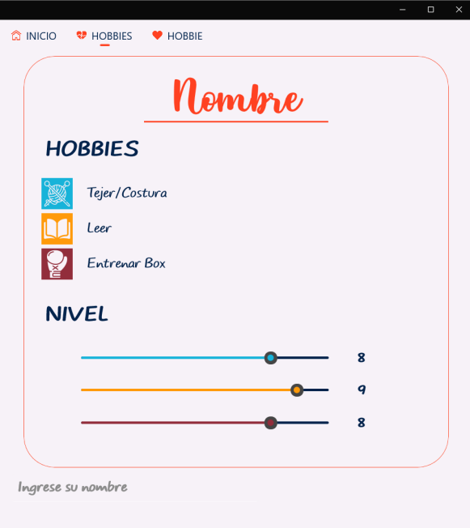 

#### Página Hobbie: 
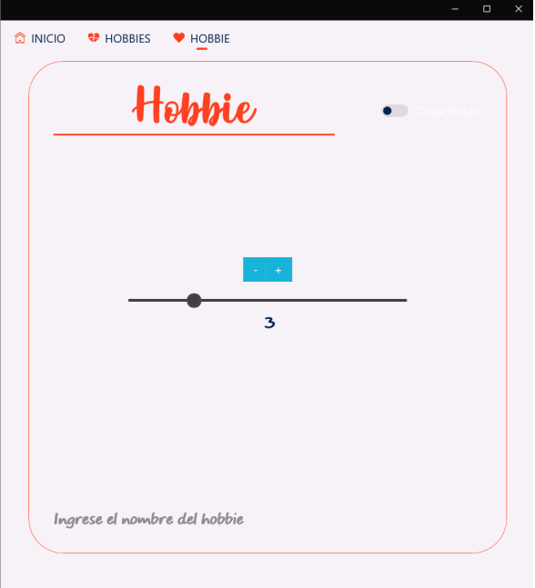 

## `TDMPW_2P_PR04` 
### **Cálculo de IVA**: 
Creación de una aplicación multiplataforma que calcule el IVA siguiendo el diseño de estructura proporcionado por el profesor con las siguientes especificaciones:
* **VISTA**: Usar fuentes personalizadas, el usario ingresará el monto, si es <= 100 el costo de Envío es $200, entre 101 y 300 el envío es $100
y si es mayor a 300 el envío es $0, también podrá selccionar el porcentaje de IVA que desea agregar, mostrar el monto total considerando el costo de envío y el IVA.
* **FUNCIONALIDAD**: Contendrá un `Slider` deshabilitado, simplemente se movera de acuerdo a los botones.

#### Página Principal: 
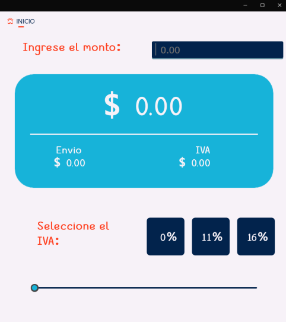 

#### Ejemplo: 
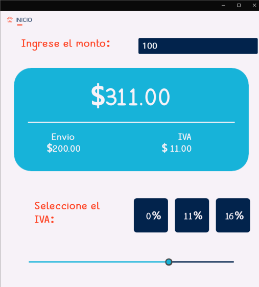 

## `TDMPW_3P_PR01` 
### **Frases Random**: 
Creación de una aplicación multiplataforma que muestre imágenes y frases random siguiendo el diseño de estructura proporcionado por el profesor con las siguientes especificaciones:
* **VISTA**: Usar fuentes personalizadas, colocar un fondo degradado, mostrar una frase aleatoria (al menos 5), agregar una imagen (debe cambiar aleatoriamente), generar fondos aleatorios con el botón, mostrar la listar de los colores que integran el fondo
* **FUNCIONALIDAD**: Contendrá un `Button` que cambiara aleatoriamente el fondo degradado, la imagen y la frase.

#####  Página Principal: 
  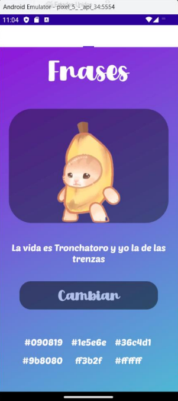 
